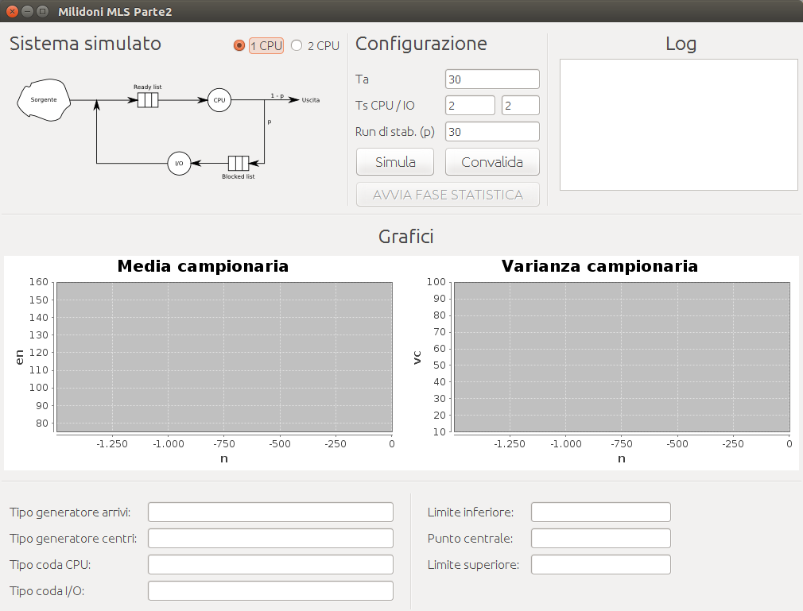
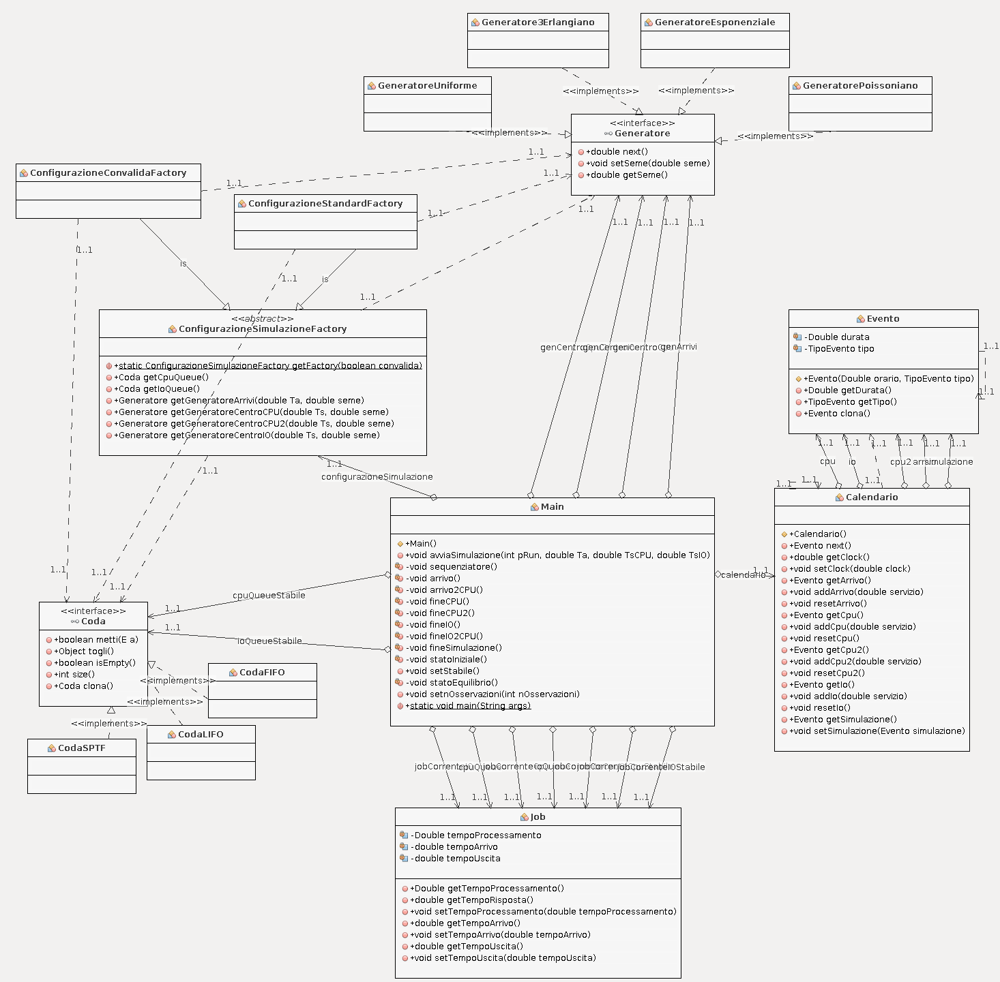
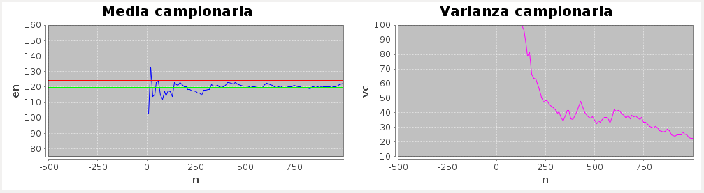
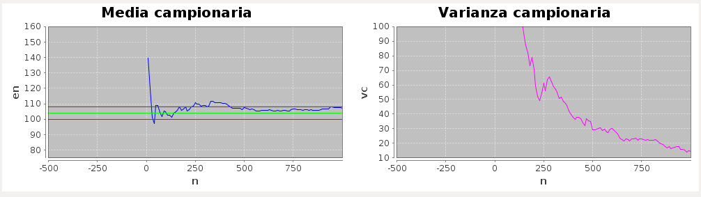
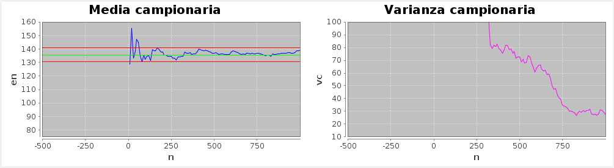

# Simulation Project

Introduzione
============

Il progetto consiste nell’implementare un
simulatore a sequenziamento di eventi e guidato da distribuzioni che
permetta di stimare la variabile di uscita U = tempo di risposta $t_q$
del sistema, ossia il tempo dall’arrivo dalla sorgente all’uscita,
nonché la sua media al 90% del livello di confidenza.

L’implementazione è stata realizzata utilizzando il linguaggio Java.
L’utilizzo delle interfacce grafiche Swing ha reso il software intuitivo
e versatile.

Dal pannello `Sistema Simulato` è possibile scegliere il sistema ad 1
CPU o a 2 CPU.

Dal pannello `Configurazione`, è possibile specificare i tempi
$T_a, T_{CPU}, T_{IO}$ ed il numero di run di stabilizzazione $p$.
Inoltre, è possibile avviare la simulazione attraverso i bottoni:

-   `Simula` per eseguire il simulatore nella configurazione standard
    ($T_a = 30, T_{CPU} = T_{IO} = 2$, disciplina arrivi esponenziale,
    disciplina centri 3-erlangiana, coda CPU di tipo SPTF, coda I/O di
    tipo LIFO);

-   `Convalida` per eseguire il simulatore nella configurazione di
    convalida, ossia portandolo nelle condizioni della figura 6.36 del
    libro di PQIS ($T_a = 30, T_{CPU} = T_{IO} = 2$, disciplina arrivi
    poissoniana, disciplina centri esponenziale, coda CPU e coda I/O di
    tipo FIFO)

Il pannello `Grafici` contiene i grafici di media e varianza
campionarie. Questi vengono popolati interattivamente durante
l’esecuzione della simulazione.

Il pannello in basso contiene le informazioni sui tipi di generatore
impostati (Poissoniano, Uniforme, ecc) e i tipi di coda (SPTF, FIFO,
ecc.). Inoltre, è presente il box informativo sui valori calcolati
dell’intervallo di confidenza.

La progettazione delle classi è stata effettuata nell’ottica di una
possibile e facile estensione per l’utilizzo di code e generatori di
diverso tipo. Per raggiungere tale obiettivo è stato utilizzato il
design pattern `Abstract Factory`. Lo schema delle classi è illustrato
in figura.

Descrizione del simulatore
--------------------------

Il processo di simulazione ha inizio
con l’inizializzazione del modello, ossia delle variabili di stato,
delle variabili di carico, del clock e del calendario.

L’esecuzione procede nel sequenziatore, il quale effettua iterazioni
eseguendo i job provenienti dal calendario. L’iterazione termina quando
si è raggiunto il numero di run desiderati e viene eseguito il processo
di Fine Simulazione.

Il processo `arrivo` imposta il tempo di arrivo del job ed il tempo di
processamento prelevandolo dal corrispondente generatore. Il job passa
alla CPU, se questa è libera, altrimenti viene immesso nella coda CPU.

Il processo `fineIO` elimina il job dall’esecuzione dell’I/O. Il job
passa alla CPU, se questa è libera, altrimenti viene immesso nella coda
CPU. Infine, viene prelevato un nuovo job dalla coda IO, se quest’ultima
non è vuota.

Il processo `fineCPU` elimina il job dall’esecuzione della CPU. Il job
può passare alla I/O se la variabile aleatoria di routing è minore di
0.9, altrimenti il job esce dal sistema e viene calcolato il tempo di
uscita.

Infine, viene prelevato un nuovo job dalla coda CPU, se quest’ultima non
è vuota.

Generatori pseudo casuali
-------------------------

Il modello di simulazione necessita dei seguenti generatori di sequenze
pseudocasuali:

-   Generatore esponenziale per la stima dei tempi di arrivo, e per la
    stima dei tempi di servizio CPU e IO del sistema di convalida

-   Generatore 3-Erlangiano per la stima dei tempi di servizio CPU e IO

-   Generatore uniforme per la scelta di routing

-   Generatore poissoniano per la stima dei tempi di arrivo del sistema
    di convalida

Esecuzione e convalida del simulatore
=====================================

L’esecuzione normale del simulatore viene effettuata portando il
simulatore nelle condizioni di distribuzioni di arrivi e servizi, e
discipline di servizio, del caso della configurazione standard. 
In particolare, vengono impostati i generatori esponenziale per
gli arrivi e 3-erlangiano per i centri, e le code sono di tipo SPTF per
il centro CPU e LIFO per il centro I/O.

Le curve della media e della varianza, utili alla rimozione iniziale
(*initial bias*) sono illustrate graficamente nel software, e vengono
riportate in figura.

La tecnica utilizzata è quella dei run replicati.

Durante l’esecuzione dei run replicati si calcola la media campionaria
della variabile osservata U:
$$\overline{U}_j(n) = n^{-1} \sum_{i=1}^n U_{ij}$$

e, da questa, si calcolano gli stimatori di media e varianza di Gordon:

$$e(n) = p^{-1} \sum_{j=1}^p \overline{U}_j(n)$$

$$s^2(\overline{U}(n)) = (p-1)^{-1} \sum_{j=1}^p [\overline{U}_j(n) - e(n)]^2$$

Osservando gli stimatori di Gordon, si noterà che la media $e(n)$
tenderà ad essere stazionaria e la varianza $s^2(\overline{U}(n))$
tenderà a decrescere linearmente. In tali condizioni si può affermare di
aver raggiunto la stabilità del sistema.

Nel caso in esame possiamo osservare che a 1000 run si ha un buon grado
di stabilità del sistema, in quanto la media campionaria è abbastanza
stabile e la varianza campionaria linearmente decrescente.

Nella fase statistica, per la stima di $\mu$ è stato utilizzato il
metodo classico:
$$(\underline{\mu}, \overline{\mu}) = (\overline{f} - d \cdot \mu_{\alpha/2}, \overline{f} + d \cdot \mu_{\alpha/2})$$

I parametri $\overline{f}, d$ e $s^2$ sono
$$\overline{f} = \overline{x}/\overline{y}$$
$$d = \frac{s}{\overline{y}\sqrt{n}}$$
$$s^2 = s^2_{11} -2 \overline{f} s^2_{12} + \overline{f}^2 s^2_{22}$$

Per il calcolo della media al 90% del livello di confidenza, si ha:
$$0.90 = 1 - \alpha; \alpha = 0.1$$
$$\frac{\alpha}{2} = 0.05; 1-\alpha/2 = 0.95$$

Confrontando il valore 0.95 con la tavola della distribuzione normale
cumulativa, si ha che $\mu_{\alpha/2} = 1.645$.

I risultati della media dei tempi di risposta e dell’intervallo di
confidenza sono i seguenti:

-   Tempo di risposta: $113.28$

-   Intervallo di confidenza: $(110.01, 116.55)$

Convalida del simulatore
------------------------

La convalida del simulatore viene effettuata portando il simulatore
nelle condizioni di distribuzioni di arrivi e servizi, e discipline di
servizio, del caso della Figura 6.36 del libro di PQIS.

Il simulatore viene quindi convalidato cliccando sul bottone
`Convalida`. Vengono impostati i generatori Poissoniano per gli arrivi
ed Esponenziale per i centri, e le code sono di tipo FIFO sia per CPU
che per I/O.

Le curve della media e della varianza del simulatore nelle condizioni di
convalida sono riportate in figura.

Nel caso della convalida, i risultati della media dei tempi di risposta
e dell’intervallo di confidenza sono i seguenti:

-   Tempo di risposta: $103.83$

-   Intervallo di confidenza: $(99.76, 107.9)$

Il tempo di risposta globale che ne scaturisce dall’analisi teorica è:

$$E(t_r) = \frac{E(n_1) + E (N_2)}{\gamma} = 105 sec$$

Pertanto, è possibile affermare che il risultato ottenuto dalla
simulazione è molto vicino a quello dell’analisi teorica.

Variante del simulatore
=======================

La variante del simulatore consiste nel portare il simulatore nelle
condizioni di avere due centri CPU, ciascuno di velocità operativa $1/2$
del singolo.

Dal corso di Prestazioni e Qualità di Impianti e Sistemi, confrontando i
due casi è noto che:

-   il tempo di attesa $E(t_w)$ migliora con il centro a capacità
    distribuita, ossia $ T_w(m, \lambda, C) \leq T_w(1, \lambda, C)$;

-   il tempo di risposta $E(t_q)$ ha un comportamento opposto a quello
    di attesa, in quanto peggiora aumentando $m$. In altre parole, il
    centro a capacità concentrata genera tempi di risposta migliori
    rispetto a quello a capacità distribuita, ossia
    $ T_q(1, \lambda, C) \leq T_q(m, \lambda, C)$.

Per verificare il comportamento del simulatore è sufficiente cliccare
sul radio-button `2 CPU` dello schema simulato del software.

Quindi, si osserva facilmente che i tempi di risposta sono superiori al
centro a capacità concentrata.

I valori di media dei tempi di risposta e intervallo di confidenza sono
confrontati nella seguente tabella.

|              | 1 CPU  |    2 CPU |
|--------------|--------|----------|
| E(T_q)       | 113.28 |   135.73 |
| Limite inf.  | 110.01 |   130.4  |
| Limite sup.  | 116.55 |   141.06 |
